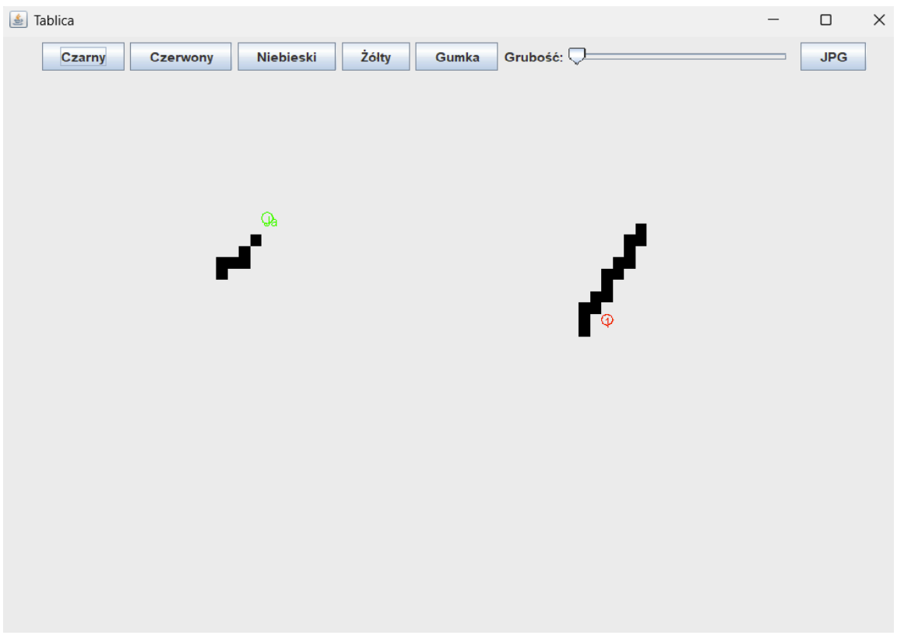

# Collaborative Whiteboard (Współdzielona Tablica Interaktywna)
## Note: Code comments, UI and report_PL are in Polish.

Java-based real-time collaborative whiteboard enabling multiple users to draw simultaneously on a shared workspace using a client-server architecture. Developed as part of the Distributed Processing course at Gdańsk University of Technology.

## Authors
Amile Amarasekara, Martyna Borkowska, Kacper Doga, Agnieszka Pawłowska, Dawid Wołoszyn, Karolina Glaza [GitHub](https://github.com/kequel)

## Key Features  
1. **Real-Time Collaboration**: Multiple clients drawing on a shared board simultaneously via TCP sockets.
2. **Efficient Synchronization**: Buffered and compressed data transmission ensures low latency and bandwidth usage.
3. **Cursor Tracking**: Each user sees both their own and others’ cursor positions (with unique IDs and colors). 
4. **Drawing Tools:**: 4 brush colors (black, red, blue, yellow) with adjustable thickness (1–5 px), eraser tool
5. **Image Export**: Save the current board as tablica.jpg.
6. **Optimized JSON Communication**: ightweight serialization using Gson.
7. **Thread-Safe Architecture**: Server and client both use concurrent data structures to handle multi-user operations safely.

## System Architecture: Client-Server Model
### Server:
- Accepts multiple client connections via ServerSocket.
- Handles synchronization, buffering, and broadcasting of drawing updates.
- Maintains the full board state in memory (ConcurrentHashMap<Point, String>).
### Client:
- GUI built with Swing (JFrame, JPanel).
- Draws locally and sends buffered updates to the server every ~40ms.
- Receives and applies updates from other users in real time.
- Displays all cursors on screen.

## Files  
| File                                | Description                                                                           |
| ----------------------------------- | ------------------------------------------------------------------------------------- |
| `Server.java`                       | Handles all client connections, synchronization, and broadcasting of drawing changes. |
| `Client.java`                       | GUI-based client enabling real-time drawing and communication with the server.        |
| `CanvasBuffer.java`                 | Local buffer storing current canvas state and pending changes to be sent.             |
| `CanvasChange.java`                 | Represents a single pixel-level change (draw or erase).                               |
| `CanvasChangeCompressed.java`       | Compressed representation of grouped drawing changes (bitmask-based).                 |
| `ChangeBuffer.java`                 | Buffers server-side changes and periodically sends compressed updates to clients.     |
| `CursorPosition.java`, `Point.java` | Utility classes for cursor and pixel position management.                             |
| `report_PL.pdf`                  | Full project report in Polish describing design, implementation, and testing.         |


## Future Development Ideas
1. Undo/Redo support – track per-user or global history of canvas changes.
2. Loading existing images – convert images into editable pixel data.
3. Advanced drawing tools – line, rectangle, or shape creation with mouse events.

## Technologies Used
- Java 23
- Swing – GUI rendering
- Gson – JSON serialization
- TCP/IP sockets – client-server communication
- ConcurrentHashMap / ReentrantLock – thread-safe operations

## Installation  
1. Clone the repository:  
```bash  
git clone https://github.com/kequel/collaborative-whiteboard.git
cd collaborative-whiteboard
```
Compile the project:
```bash
javac -cp gson.jar *.java
```
Run the server:
```bash
java -cp gson.jar;. Server
```
Run clients (in separate terminals or machines)
```bash
java -cp gson.jar;. Client
```
Each connected client will be assigned a unique ID and see all real-time updates on the shared canvas.

## Example
Collaborative session with visible local (green) and remote (red) cursors:


Exported image:

